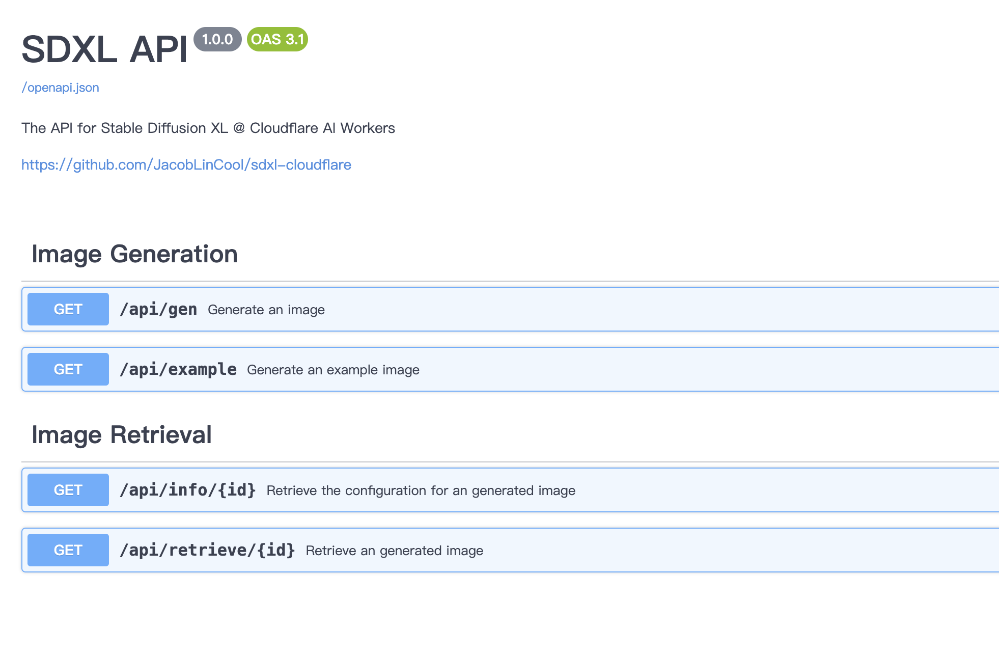

# SDXL API

SDXL API provides a seamless interface for image generation and retrieval using Stable Diffusion XL integrated with Cloudflare AI Workers. This API allows users to generate and manage images in a highly efficient and scalable manner.

## Features

-   **Image Generation:** Generate images from text prompts with customizable steps.
-   **Image Retrieval:** Retrieve generated images and their configurations. (opt-in with R2 binding)

## Usage

I recommend to use this as an [Service Binding](https://developers.cloudflare.com/workers/configuration/bindings/about-service-bindings/), and use Cloudflare Zero Trust to protect the Swagger UI. By this way, your other applications and still access the service with Service Binding, while the Swagger UI is protected by Cloudflare Zero Trust and only you (and the one you trust) can access it.

## Contributions

Your contributions and suggestions are heartily welcome.
